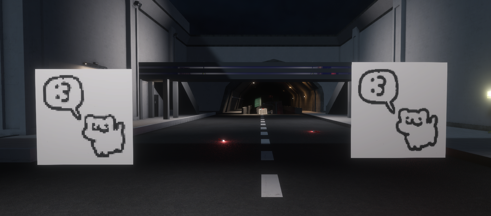

# PrImage

## Overview
PrImage is a project designed to generate images ingame using primitives. This project is HIGHLY WIP and will reduce your framerate in some cases.

## Demo


## Installation
Simply drop the PrImage.dll into your plugins folder.

## Usage (ingame)
You can create images directly using commands.

generateimage [path-to-image] [maxWidth] [maxHeight] [duration] [targetWidth] [targetHeight]

OR

gri [path-to-image] [maxWidth] [maxHeight] [duration] [targetWidth] [targetHeight]

### Arguments:

1. **`[path-to-image]`** _(required)_
   - **Description**: The full path to the image file you want to render in the game.
   - **Example**: `"C:\\Users\\Administrator\\AppData\\Roaming\\EXILED\\Images\\testimage.png"`

2. **`[maxWidth]`** _(optional, default: 4)_
   - **Description**: The maximum width at which the image will be rendered in the game. The image will be scaled proportionally based on this value and the height.
   - **Example**: `4` (The image will be scaled to fit a maximum width of 4 units.)

3. **`[maxHeight]`** _(optional, default: 4)_
   - **Description**: The maximum height at which the image will be rendered in the game. The image will be scaled proportionally based on this value and the width.
   - **Example**: `4` (The image will be scaled to fit a maximum height of 4 units.)

4. **`[duration]`** _(optional, default: 30)_
   - **Description**: The duration in seconds for which the image will remain visible in the game before it fades out.
   - **Example**: `30` (The image will be visible for 30 seconds before being removed.)

5. **`[targetWidth]`** _(optional, default: 32)_
   - **Description**: The target width in pixels to which the image will be resized. This value determines the number of pixels used to render the image on the screen.
   - **Example**: `64` (The image will be resized to 64 pixels in width before rendering.)

6. **`[targetHeight]`** _(optional, default: 32)_
   - **Description**: The target height in pixels to which the image will be resized. This value determines the number of pixels used to render the image on the screen.
   - **Example**: `64` (The image will be resized to 64 pixels in height before rendering.)

## Usage (code)

### 1. `RenderImage(Exiled.API.Features.Player player, string imagePath, float maxWidth = 4f, float maxHeight = 4f, float distance = 2f, float duration = 30f, int targetWidth = 32, int targetHeight = 32)`

**Description**:  
This method renders an image in front of a specified player. The image will be resized to fit within the provided dimensions and then displayed as quads in the game world. 

#### Arguments:
- **`player`** (Exiled.API.Features.Player) _(required)_  
  The player in front of whom the image should be displayed. The image will be placed relative to the player's position and facing direction.
  
- **`imagePath`** (string) _(required)_  
  The full path to the image you wish to render. The file should be a valid image format (e.g., PNG, JPEG).
  
- **`maxWidth`** (float) _(optional, default: 4)_  
  The maximum width of the image in game units. The image will be scaled proportionally based on the width and the height.

- **`maxHeight`** (float) _(optional, default: 4)_  
  The maximum height of the image in game units. The image will be scaled proportionally based on the height and the width.

- **`distance`** (float) _(optional, default: 2)_  
  The distance (in units) at which the image will be placed in front of the player. The image will be displayed at this distance from the player's camera.
  
- **`duration`** (float) _(optional, default: 30)_  
  The duration (in seconds) for which the image will remain visible. After the specified duration, the image will be removed.

- **`targetWidth`** (int) _(optional, default: 32)_  
  The target width (in pixels) to which the image should be resized for rendering. A smaller value will reduce the number of quads generated, thus improving performance.
  
- **`targetHeight`** (int) _(optional, default: 32)_  
  The target height (in pixels) to which the image should be resized for rendering. A smaller value will reduce the number of quads generated, improving performance.

#### Example Usage:
```csharp
// Render an image for the player in front of them with a max width of 6, max height of 6,
// at a distance of 2 units, and with a duration of 20 seconds. The image will be resized to 64x64 pixels.
ImageRendererAPI.RenderImage(player, "C:\\path\\to\\image.png", 6f, 6f, 2f, 20f, 64, 64);
```


## License
This project is licensed under the MIT License. See the `LICENSE` file for details.